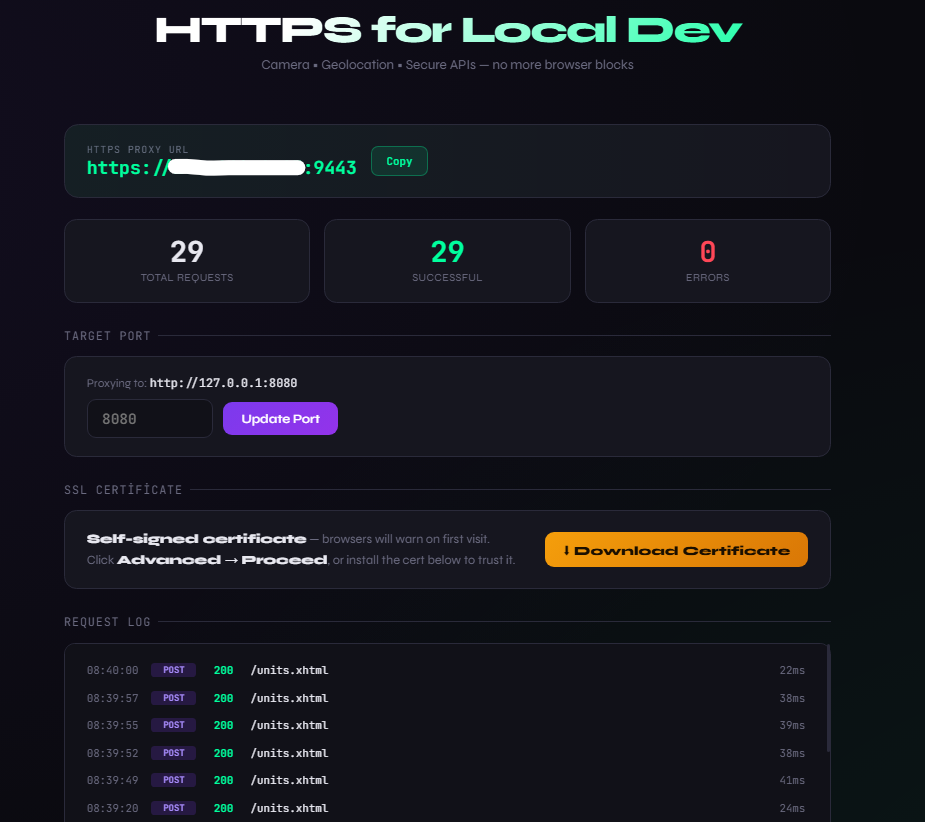

# Local HTTPS Proxy

> Spring Boot geliştirmelerinde kamera, konum ve diğer secure-context API'leri için  
> lokal HTTPS reverse proxy — ngrok gerektirmez, internet bağlantısı gerekmez.

---


## Gereksinimler

- Java 17+
- Maven 3.6+

---

## Hızlı Başlangıç

### Linux / macOS
```bash
chmod +x run.sh
./run.sh
```

### Windows
```
run.bat
```

### Manuel
```bash
mvn package -DskipTests

java \
  --add-exports java.base/sun.security.x509=ALL-UNNAMED \
  --add-exports java.base/sun.security.util=ALL-UNNAMED \
  -jar target/local-https-proxy.jar
```

---

## Nasıl Çalışır?

1. Uygulama açılışta **yerel ağ IP adresinizi** otomatik tespit eder (örn. `192.168.1.42`)
2. Spring Boot uygulamanızın **portunu** sorar (örn. `8080`)
3. Self-signed sertifika ile **HTTPS proxy** başlatır: `https://192.168.1.42:9443`
4. **Admin UI** açılır: `http://localhost:9444`

Tüm HTTPS istekler → `http://localhost:PORT` adresine iletilir.

---

## Portlar

| Port | Açıklama |
|------|----------|
| `9443` | HTTPS proxy (tüm cihazlardan erişilebilir) |
| `9444` | Admin UI (sadece localhost) |

---

## Sertifika Uyarısı

Tarayıcı "Bağlantı güvenli değil" uyarısı gösterir. İki seçenek:

### Hızlı yol (test için)
- Chrome/Edge: **Gelişmiş → Siteye devam et**
- Firefox: **Riski kabul et ve devam et**

### Sertifika yükleme (kalıcı çözüm)
1. Admin UI'dan **"Download Certificate"** butonuna tıklayın
2. **Android**: Ayarlar → Güvenlik → Sertifika yükle
3. **iOS**: İndirilen `.crt` dosyasına dokunun → Ayarlar → Genel → VPN ve Cihaz Yönetimi → Profili yükle → **Ayarlar → Genel → Sertifika Güveni → etkinleştir**
4. **Mac**: Finder → çift tık → Anahtarlık → "Her Zaman Güven"
5. **Windows**: Çift tık → Sertifika yükle → Yerel Makine → "Güvenilen Kök CA"

---

## Admin UI Özellikleri

- 📊 **Canlı istatistikler** — toplam / başarılı / hata sayıları
- 📋 **Request log** — method, path, status, süre
- 🔧 **Port değiştirme** — Spring Boot portunu çalışırken güncelleyin
- 📜 **Sertifika indirme** — cihazlara kurulum için

---

## Kullanım Senaryoları

- 📸 **Kamera API** — HTTPS zorunlu (`getUserMedia`)  
- 📍 **Geolocation API** — HTTPS zorunlu  
- 🔔 **Web Push / Notifications** — HTTPS zorunlu  
- 🔑 **WebAuthn / FIDO2** — HTTPS zorunlu  
- 🌐 **PWA / Service Workers** — HTTPS zorunlu  
- 📱 **Mobil cihazda test** — aynı WiFi üzerinden erişim

---

## Spring Boot Ayarları

Proxy `X-Forwarded-*` headerlarını otomatik ekler. Spring Boot'ta şunu ekleyin:

```properties
# application.properties
server.forward-headers-strategy=native
```

---

## Güvenlik Notu

Bu araç **sadece lokal geliştirme** içindir. Self-signed sertifika internet ortamında güvenilir değildir ve üretim ortamında kullanılmamalıdır.
